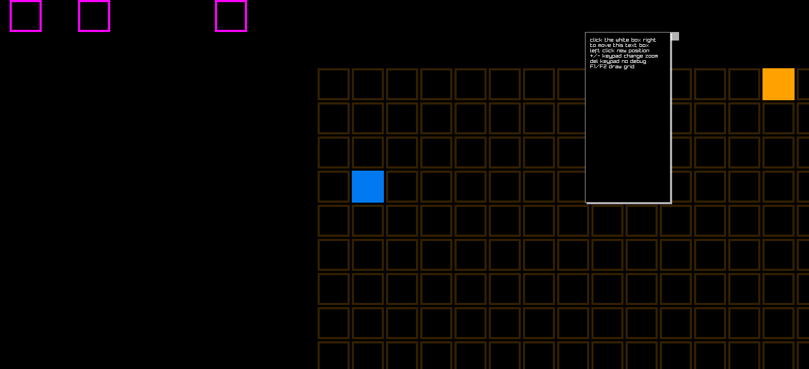

# better_dungeonmap_scrolling
Revised scrolling map with floating text / menu window as well as zoom

Much improved scrolling top down dungeon map. There is a movable menu window with text, simply left click the right hand white box of the menu and left click the new position.

When menu is not selected left click inside building for player movement and camera will follow, zoom with keypad +/-

  

